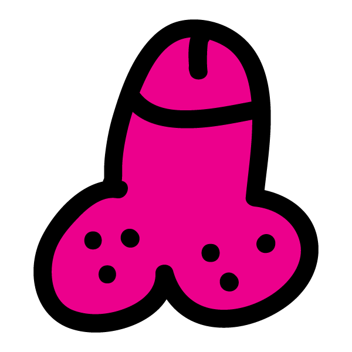

# jakebyrnewrites

> Jake Byrne / poet[aster]

This project is based on the [Contentful CLI blog template](https://www.contentful.com/developers/docs/tutorials/general/get-started/). Read more about the CLI [here](https://www.npmjs.com/package/contentful-cli).

## Introduction

This project's build system includes the following features:

- static site generation
- dynamic server side rendering for development
- deploy to [now](https://zeit.co/now)
- responsive images via [Images API](https://www.contentful.com/developers/docs/references/images-api/)
- tags for blog posts

## Getting started

To set this project up for development please check out [the getting started guide](./docs/GETTING-STARTED.md).

## Technical stack

This project is based on [nuxt.js](https://nuxtjs.org/).

### Why nuxt.js?

Nuxt.js is based on [Vue.js](https://vuejs.org/). Vue is a fairly new JS framework that provides excellent documentation and is a pleasure to work with. nuxt.js sits on top of Vue and was choosen because of two main feature:

- dynamic server side rendering for development
- static file generation for production

For detailed explanation on how things work, check out the [Nuxt.js docs](https://github.com/nuxt/nuxt.js).

